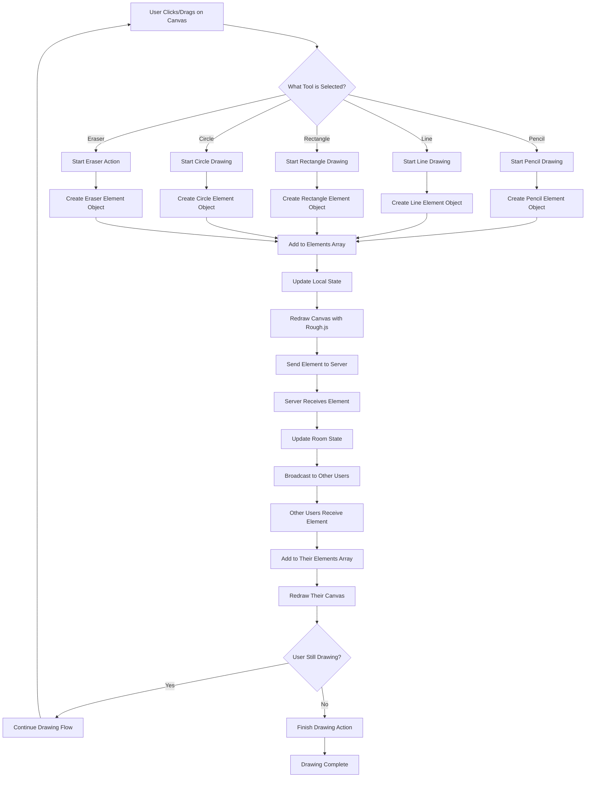
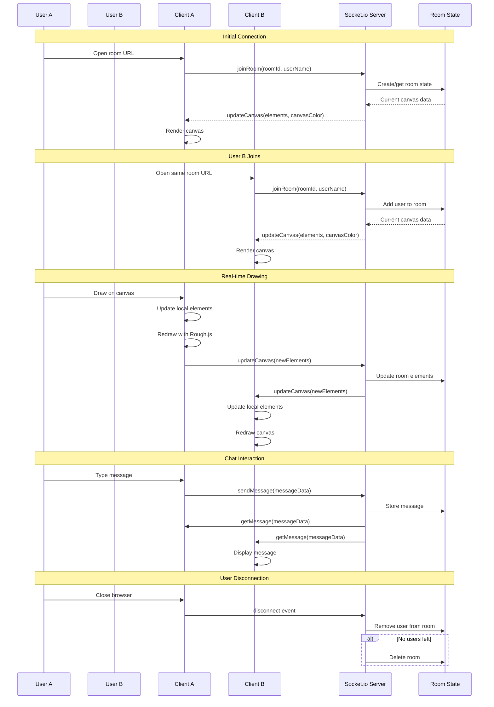
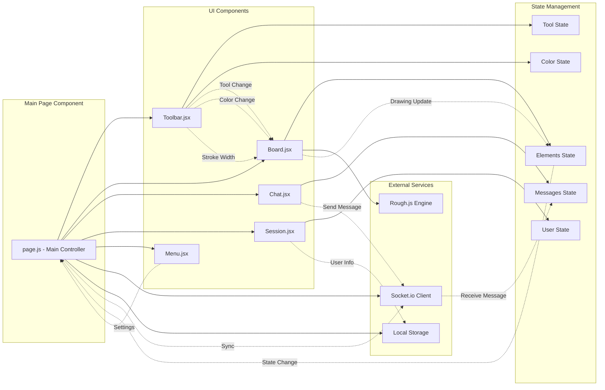
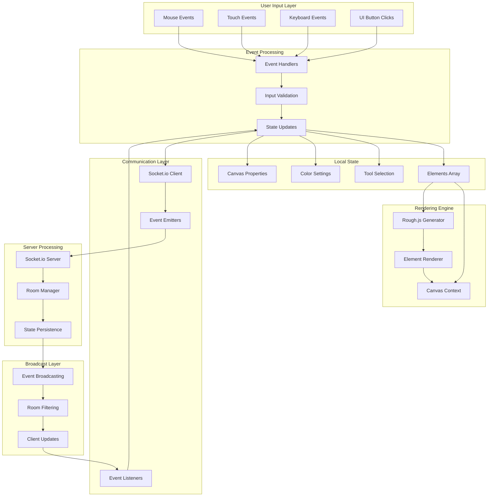
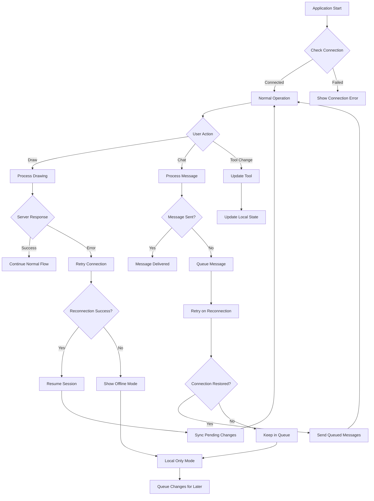
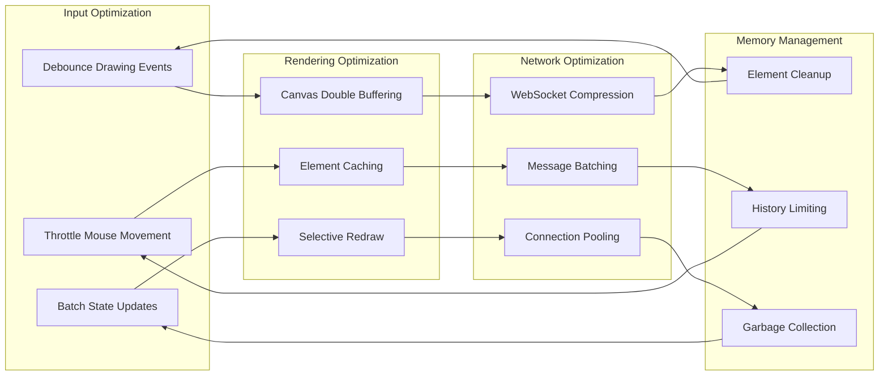

# InkSync Project Flow Diagram

## Complete User Journey Flow

```mermaid
flowchart TD
    A[User Opens Browser] --> B[Navigate to InkSync URL]
    B --> C{Is Room ID in URL?}

    C -->|No| D[Landing Page]
    C -->|Yes| E[Direct to Room]

    D --> F[User Enters Room ID]
    F --> G[Generate 20-char Room ID]
    G --> H[Redirect to /room/[roomId]]

    E --> I[Initialize Room Session]
    H --> I

    I --> J[Load Main Page Component]
    J --> K[Initialize Canvas & Tools]
    K --> L[Connect to Socket.io Server]

    L --> M{Connection Successful?}
    M -->|No| N[Show Error Message]
    M -->|Yes| O[Join Room via Socket]

    O --> P[Receive Current Canvas State]
    P --> Q[Display Canvas with Existing Elements]

    Q --> R[User Can Start Drawing]
    R --> S{User Action Type}

    S -->|Draw| T[Handle Drawing Action]
    S -->|Chat| U[Handle Chat Message]
    S -->|Tool Change| V[Update Tool Selection]
    S -->|Settings| W[Open Settings Menu]

    T --> X[Update Local Canvas State]
    X --> Y[Send Drawing Data to Server]
    Y --> Z[Server Broadcasts to Other Users]
    Z --> AA[Other Users Receive Update]
    AA --> BB[Other Users Redraw Canvas]

    U --> CC[Send Message to Server]
    CC --> DD[Server Broadcasts Message]
    DD --> EE[All Users Receive Message]
    EE --> FF[Display Message in Chat]

    V --> GG[Update Tool State]
    GG --> HH[Change Cursor/Interface]

    W --> II[Show Settings Options]
    II --> JJ{Setting Type}
    JJ -->|Clear Canvas| KK[Clear All Elements]
    JJ -->|Change Color| LL[Update Canvas Color]
    JJ -->|Stroke Width| MM[Update Stroke Width]
    JJ -->|Username| NN[Update User Name]

    KK --> OO[Broadcast Clear to All Users]
    LL --> PP[Update Canvas Background]
    MM --> QQ[Apply New Stroke Width]
    NN --> RR[Update User Display]

    R --> SS{User Continues?}
    SS -->|Yes| R
    SS -->|No| TT[User Closes Browser/Tab]

    TT --> UU[Socket Disconnect Event]
    UU --> VV[Remove User from Room]
    VV --> WW{Any Users Left in Room?}
    WW -->|Yes| XX[Keep Room Active]
    WW -->|No| YY[Delete Room & Clear State]

    XX --> ZZ[Room Remains Active for Reconnection]
    YY --> AAA[Clean Up Room Resources]
```

## Detailed Drawing Flow



## Real-time Synchronization Flow



## Component Interaction Flow



## Data Flow Architecture



## Error Handling & Recovery Flow



## Performance Optimization Flow



## Key Flow Summary

### **1. Application Startup Flow**

1. **User Access** → Browser opens InkSync URL
2. **Room Detection** → Check for room ID in URL
3. **Room Creation/Join** → Generate or use existing room ID
4. **Component Initialization** → Load React components
5. **Socket Connection** → Connect to real-time server
6. **State Synchronization** → Receive current canvas state

### **2. Drawing Flow**

1. **User Input** → Mouse/touch events on canvas
2. **Tool Processing** → Apply selected tool (pencil, line, etc.)
3. **Element Creation** → Create drawing element object
4. **Local Update** → Update local state and redraw
5. **Server Sync** → Send element to server via WebSocket
6. **Broadcast** → Server sends to all other users
7. **Remote Update** → Other users receive and redraw

### **3. Chat Flow**

1. **Message Input** → User types in chat
2. **Local Display** → Show message immediately
3. **Server Send** → Send message to server
4. **Broadcast** → Server sends to all room users
5. **Remote Display** → Other users see message

### **4. Room Management Flow**

1. **User Join** → Socket connection with room ID
2. **State Sync** → Receive current room state
3. **Active Session** → Real-time collaboration
4. **User Leave** → Remove from room
5. **Room Cleanup** → Delete room if empty

### **5. Error Recovery Flow**

1. **Connection Loss** → Detect disconnection
2. **Local Mode** → Continue drawing locally
3. **Reconnection** → Attempt to reconnect
4. **State Sync** → Sync pending changes
5. **Resume** → Return to normal operation

This flow ensures a smooth, real-time collaborative drawing experience with robust error handling and performance optimization!
