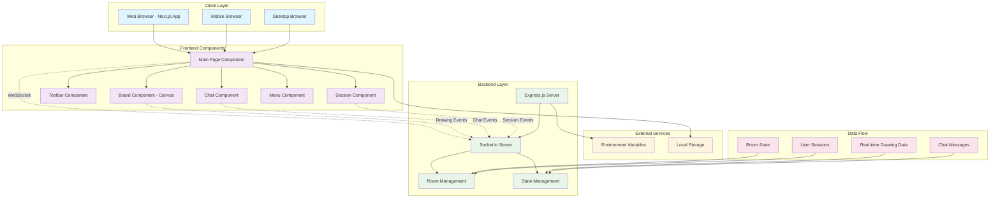
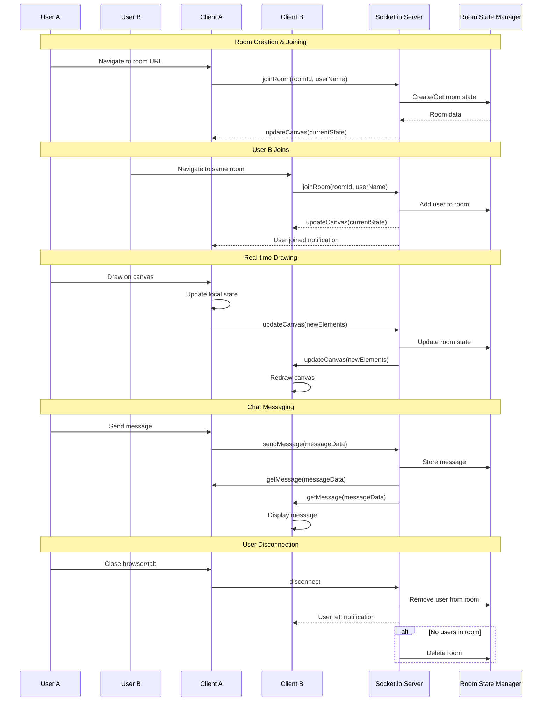
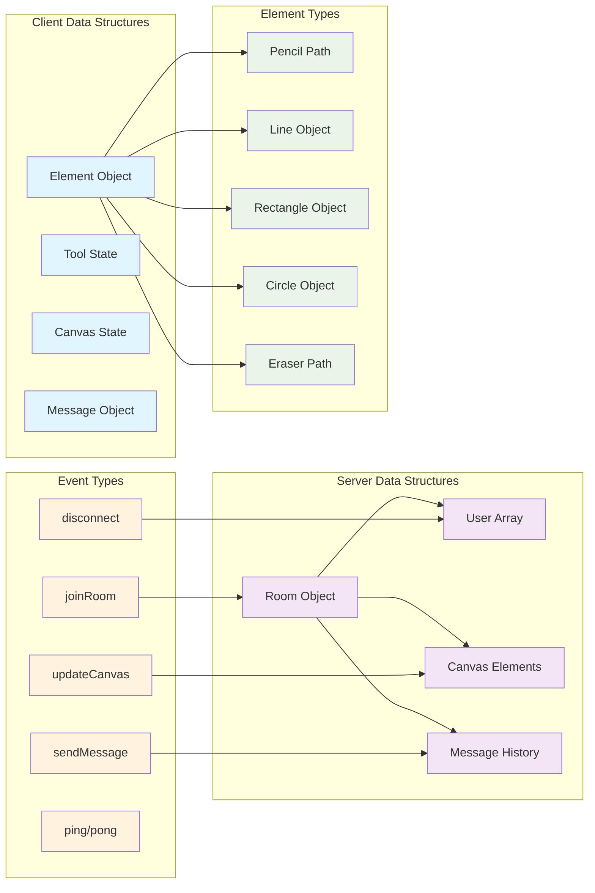
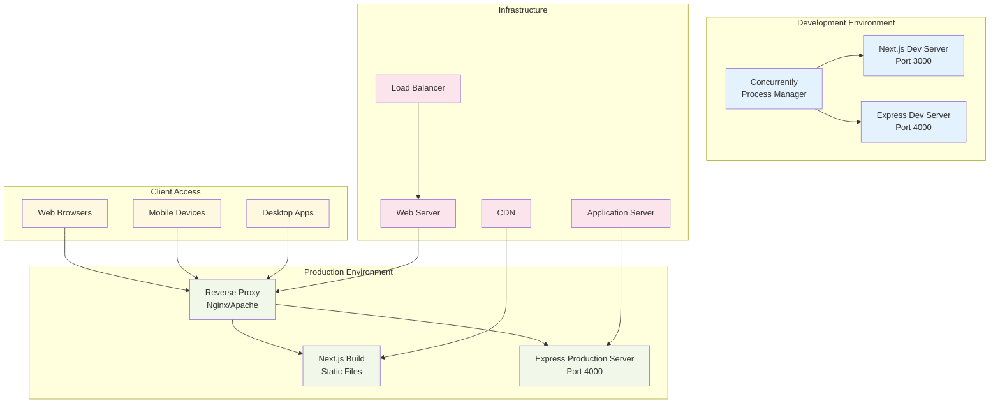

# InkSync System Architecture Diagram

## High-Level System Architecture



## Detailed Component Architecture

```mermaid
graph TB
    subgraph "Frontend Architecture (Next.js)"
        subgraph "App Layer"
            A1[app/page.js - Main Entry]
            A2[app/room/[roomId]/page.jsx - Room Route]
            A3[app/layout.js - Root Layout]
        end

        subgraph "Component Layer"
            B1[Board.jsx - Canvas Drawing]
            B2[Toolbar.jsx - Drawing Tools]
            B3[Chat.jsx - Messaging]
            B4[Session.jsx - User Management]
            B5[Menu.jsx - Settings]
        end

        subgraph "State Management"
            C1[Local State - Elements]
            C2[Local State - History]
            C3[Local State - Tools]
            C4[Local State - Messages]
        end

        subgraph "External Libraries"
            D1[Rough.js - Drawing Engine]
            D2[Socket.io-client - Real-time]
            D3[React-color - Color Picker]
            D4[React-icons - UI Icons]
        end
    end

    subgraph "Backend Architecture (Express + Socket.io)"
        subgraph "Server Layer"
            E1[index.js - Main Server]
            E2[Express App - HTTP Server]
            E3[Socket.io - WebSocket Server]
        end

        subgraph "Room Management"
            F1[Room State Storage]
            F2[User Connection Tracking]
            F3[Canvas State Persistence]
            F4[Message History]
        end

        subgraph "Event Handlers"
            G1[joinRoom Event]
            G2[updateCanvas Event]
            G3[sendMessage Event]
            G4[disconnect Event]
        end
    end

    subgraph "Data Flow"
        H1[Drawing Actions]
        H2[Chat Messages]
        H3[Room Joins/Leaves]
        H4[State Synchronization]
    end

    %% Frontend connections
    A1 --> B1
    A1 --> B2
    A1 --> B3
    A1 --> B4
    A1 --> B5

    B1 --> C1
    B1 --> C2
    B2 --> C3
    B3 --> C4

    B1 --> D1
    A1 --> D2
    B2 --> D3
    B2 --> D4

    %% Backend connections
    E1 --> E2
    E1 --> E3
    E3 --> F1
    E3 --> F2
    E3 --> F3
    E3 --> F4

    E3 --> G1
    E3 --> G2
    E3 --> G3
    E3 --> G4

    %% Data flow
    H1 --> G2
    H2 --> G3
    H3 --> G1
    H4 --> G2

    %% Cross-layer connections
    D2 -.->|WebSocket| E3
    C1 -.->|Real-time Sync| F3
    C4 -.->|Message Sync| F4

    classDef appLayer fill:#e3f2fd
    classDef componentLayer fill:#f1f8e9
    classDef stateLayer fill:#fff8e1
    classDef libraryLayer fill:#fce4ec
    classDef serverLayer fill:#e8f5e8
    classDef roomLayer fill:#f3e5f5
    classDef eventLayer fill:#fff3e0
    classDef dataLayer fill:#e0f2f1

    class A1,A2,A3 appLayer
    class B1,B2,B3,B4,B5 componentLayer
    class C1,C2,C3,C4 stateLayer
    class D1,D2,D3,D4 libraryLayer
    class E1,E2,E3 serverLayer
    class F1,F2,F3,F4 roomLayer
    class G1,G2,G3,G4 eventLayer
    class H1,H2,H3,H4 dataLayer
```

## Real-time Communication Flow



## Data Structure Architecture



## Deployment Architecture



## Security & Performance Considerations

```mermaid
graph TB
    subgraph "Security Measures"
        A1[CORS Configuration]
        A2[Input Validation]
        A3[Rate Limiting]
        A4[WebSocket Security]
    end

    subgraph "Performance Optimizations"
        B1[Canvas Optimization]
        B2[WebSocket Compression]
        B3[State Debouncing]
        B4[Memory Management]
    end

    subgraph "Scalability Features"
        C1[Room-based Isolation]
        C2[Stateless Design]
        C3[Horizontal Scaling]
        C4[Load Balancing]
    end

    subgraph "Monitoring & Logging"
        D1[Connection Monitoring]
        D2[Error Tracking]
        D3[Performance Metrics]
        D4[User Analytics]
    end

    A1 --> A4
    A2 --> A4
    A3 --> A4

    B1 --> B2
    B2 --> B3
    B3 --> B4

    C1 --> C2
    C2 --> C3
    C3 --> C4

    D1 --> D2
    D2 --> D3
    D3 --> D4

    classDef security fill:#ffebee
    classDef performance fill:#e8f5e8
    classDef scalability fill:#e3f2fd
    classDef monitoring fill:#fff3e0

    class A1,A2,A3,A4 security
    class B1,B2,B3,B4 performance
    class C1,C2,C3,C4 scalability
    class D1,D2,D3,D4 monitoring
```



## Key Technical Specifications

### **Frontend Stack**

- **Framework**: Next.js 14 (React 18)
- **Styling**: Tailwind CSS
- **Drawing**: Rough.js + HTML5 Canvas
- **Real-time**: Socket.io-client
- **UI Components**: React Icons, React Color

### **Backend Stack**

- **Runtime**: Node.js
- **Framework**: Express.js
- **Real-time**: Socket.io
- **CORS**: Cross-origin resource sharing
- **Environment**: dotenv for configuration

### **Communication Protocol**

- **Transport**: WebSocket (Socket.io)
- **Events**: joinRoom, updateCanvas, sendMessage, disconnect
- **Data Format**: JSON
- **Compression**: Built-in Socket.io compression

### **State Management**

- **Client**: React useState hooks
- **Server**: In-memory room objects
- **Persistence**: Session-based (cleared on disconnect)
- **Synchronization**: Real-time broadcast

### **Deployment**

- **Development**: Concurrently running both servers
- **Production**: Static build + Express server
- **Ports**: Frontend (3000), Backend (4000)
- **Scaling**: Room-based horizontal scaling possible
